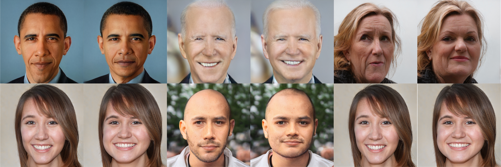

# Cross-Domain and Disentangled Face Manipulation with 3D Guidance


### [Project Page](https://cassiepython.github.io/cddfm3d/index) | [Paper (ArXiv & TVCG)](https://arxiv.org/abs/2104.11228)

[Can Wang](https://cassiepython.github.io/)<sup>1</sup>,
[Menglei Chai](https://mlchai.com/)<sup>2</sup>,
[Mingming He](http://mingminghe.com/)<sup>3</sup>,
[Dongdong Chen](http://www.dongdongchen.bid/)<sup>4</sup>,
[Jing Liao](https://liaojing.github.io/html/)<sup>1</sup> <br>
<sup>1</sup>City University of Hong Kong, <sup>2</sup>Creative Vision, Snap Inc., <sup>3</sup>USC Institute for Creative Technologies, <sup>4</sup>Microsoft Cloud AI


## Abstract

Face image manipulation via three-dimensional guidance has been widely applied in various interactive scenarios due to its semantically-meaningful understanding and user-friendly controllability. However, existing 3D-morphable-model-based manipulation methods are not directly applicable to out-of-domain faces, such as non-photorealistic paintings, cartoon portraits, or even animals, mainly due to the formidable difficulties in building the model for each specific face domain. To overcome this challenge, we propose, as far as we know, the first method to manipulate faces in arbitrary domains using human 3DMM. This is achieved through two major steps: 1) disentangled mapping from 3DMM parameters to the latent space embedding of a pre-trained StyleGAN2 that guarantees disentangled and precise controls for each semantic attribute; and 2) cross-domain adaptation that bridges domain discrepancies and makes human 3DMM applicable to out-of-domain faces by enforcing a consistent latent space embedding. Experiments and comparisons demonstrate the superiority of our high-quality semantic manipulation method on a variety of face domains with all major 3D facial attributes controllable – pose, expression, shape, albedo, and illumination. Moreover, we develop an intuitive editing interface to support user-friendly control and instant feedback.


## Getting Started

### 0. Requirements ###

- Python 3.8
- Torch 1.7.1 or Torch 1.8.0
- Pytorch3D for rendering images

Note: Related checkpoints and 3DMM bases can be downloaded from [here](https://drive.google.com/drive/folders/1qNvRu8vLPD278FW7GS-I9p6-yxYhKZY9?usp=sharing); you can also take the following steps to prepare these.

### 1. Data Preparation ###

1. Download the StyleGAN2 checkpoint from [here](https://drive.google.com/drive/folders/1LuvEw3ZZus-hFe73_G0uPmX3U8tOqPEm) and place it into the 'stylegan2-pytorch/checkpoint' directory.
2. For quickly trying our method, I recommend to generate 4K latent(StyleSpace)&image training pairs:

```
cd stylegan2-pytorch
python generate_data.py --pics 4000 --ckpt checkpoint/stylegan2-ffhq-config-f.pt
```

Once finished, you will acquire 'Images', 'latents.pkl', and 'constants.pkl' files.

### 2. Estimate 3DMM Parameters and Facial Landmarks

1. Download checkpoint from [here](https://drive.google.com/drive/folders/1_m1ZDwc2pjMUIzl5T4_bi7ZmrBBiiSqm) and place it into the 'Deep3DFaceReconstruction-pytorch/network' directory;
2. Download 3DMM bases from [here](https://drive.google.com/drive/folders/1_m1ZDwc2pjMUIzl5T4_bi7ZmrBBiiSqm) and place these files into the 'Deep3DFaceReconstruction-pytorch/BFM' directory;
3. Estimate 3DMM parameters and facial Landmarks:

```
cd Deep3DFaceReconstruction
python extract_gt.py ../stylegan2/Images
```

Once finished, you will acquire the 'params.pkl' file. Then estimate the landmarks using dlib and split training and testing datasets.
Please download the dlib landmark predictor from [here](https://drive.google.com/file/d/1wDnffHOuoXB8B33R2y7ZQCU7IfVMxIVx/view?usp=sharing) and place it into the 'sample_dataset' directory.

```
mv stylegan2/Images sample_dataset/
mv stylegan2/latents.pkl sample_dataset/
mv stylegan2/constants.pkl sample_dataset/
mv Deep3DFaceReconstruction-pytorch/params.pkl sample_dataset/
cd sample_dataset/
python extract_landmarks.py
python split_train_test.py
```

### 3. Training and Testing the Attribute Prediction Network

Copy BFM from Deep3DFaceReconstruction:

```
cp -r Deep3DFaceReconstruction-pytorch/BFM/ ./bfm/
```

Then train the Attribute Prediction Network:

```
python train.py --name apnet_wpdc --model APModel --train_wpdc
```

Test the Attribute Prediction Network and you will find results (the rendered image and the mesh) in the 'results' directory:

```
python evaluate.py --name apnet_wpdc --model APModel
```

Some test results of APNet (Please use more synthesized data to improve performance and training robustness):


Some important parameters for training or testing:

|  Parameter  | Default | Description  |
|  ----  | ----  | ----  |
| --name  | 'test' | name of the experiment |
| --model  | 'APModel' | which model to be trained |
| --train_wpdc | False | whether use WPDC loss |
| --w_wpdc | 0.1 | weight of the WPDC loss
| --data_dir | 'sample_dataset' | path to dataset |
| --total_epoch | 200 | total epochs for training |
| --save_interval | 20 | interval to save the model |
| --batch_size | 128 | batch size to train the model |
| --load_epoch | -1 (the final saved model) | which checkpoint to load for testing |


### 4. Training and Testing the Editing Network

Train the Encoder and Decoder for the attribute editing in real face domain (e.g. shape editing):

```
python train.py --name shape --model RIGModelS --train_render --train_landmark --train_rec --train_edge --load_apnet_epoch 80
```

Test the editing process and you will find results (the rendered images, meshes, and editing results) in the 'results' directory:

```
python evaluate.py --name shape --model RIGModelS --load_apnet_epoch 80
```

Some test results of Shape editing (Please use more synthesized data to improve performance and training robustness):



Some important parameters for training or testing:

|  Parameter  | Default | Description  |
|  ----  | ----  | ----  |
| --train_render | False | whether use render loss |
| --train_landmark | False | whether use landmark loss |
| --train_rec | False | whether use recycle loss |
| --train_edge | False | whether use edge loss (only for shape editing) |
| --load_apnet_epoch | -1 | which APNet to load for training or testing |
| --model | 'RIGModelS' | RIGModelS, RIGModelE, RIGModelL, RIGModelP, RIGModelA for shape, expression, light, pose, and albedo editing |

### 5. Finetuning for Out-of-domain Faces

Download the Disney girl dataset from [here](https://drive.google.com/drive/folders/14CuyyUP9p-GZ54CsSuN08WlulWhQKLba?usp=sharing). Thanks
[Jing Bo](https://scholar.google.com/citations?user=M8I1aE4AAAAJ&hl=zh-CN) for helping collect this dataset from [Pinterest](https://www.pinterest.com/).
Other datasets used in our paper can be obtained from the Internet, please refer to our paper.

Preprocess the dataset:

```
cd stylegan2/
python prepare_data.py --out LMDB_disney_1024 --n_worker 2 --size 1024 data_disney_girl
```

Finetuning StyleGAN2:

```
python finetune.py --ckpt checkpoint/stylegan2-ffhq-config-fine.pt --size 1024 --batch 16 --n_sample 2 LMDB_dog_1024/
```

I recommend to finetune using multi-gpus by adding 'CUDA_VISIBLE_DEVICES=0,1,2,3'. Try reducing the batch-size and n_sample
to support a single gpu. Given a latent code corresponding to a non-real human face, you can edit it using the Editing Network trained in step 4, but produce results with the finetuned checkpoint. You can directly download the finetuned models from [here](https://drive.google.com/drive/folders/13StJr2xP4MTxOyrfRK_q_soBhZQo1xG3?usp=sharing).

```
ppython evaluate.py --name shape --model RIGModelS --load_apnet_epoch 80
```


## To Do
- [ ] ~~Code for generating latent&image training pairs;~~
- [ ] ~~Code for estimating 3DMM parameters and landmarks;~~
- [ ] ~~Code and pre-trained models for the Attribute Prediction Network;~~
- [ ] ~~Code and pre-trained models for the Latent Manipulation Network;~~
- [ ] ~~Code, Data and pre-trained models for Latent-Consistent Finetuning;~~
- [ ] A Google Colab to train and test the method.


## References

- StyleGAN2-pytorch: https://github.com/rosinality/stylegan2-pytorch
- Deep3DFaceReconstruction-pytorch: https://github.com/changhongjian/Deep3DFaceReconstruction-pytorch
- FreezeG: https://github.com/bryandlee/FreezeG

## Citation

If you find our work useful for your research, please consider citing the following papers :)

```
@article{wang2021cross,
  title={Cross-Domain and Disentangled Face Manipulation with 3D Guidance},
  author={Wang, Can and Chai, Menglei and He, Mingming and Chen, Dongdong and Liao, Jing},
  journal={arXiv preprint arXiv:2104.11228},
  year={2021}
}
```
