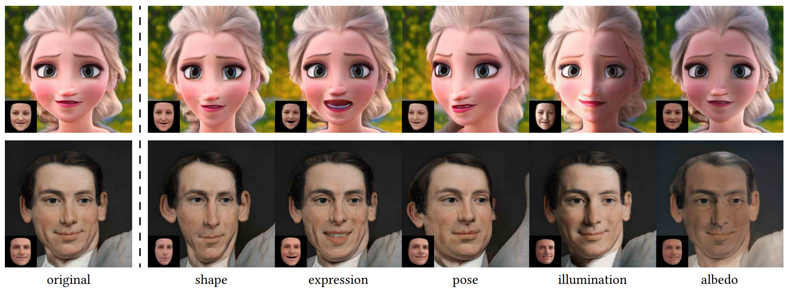
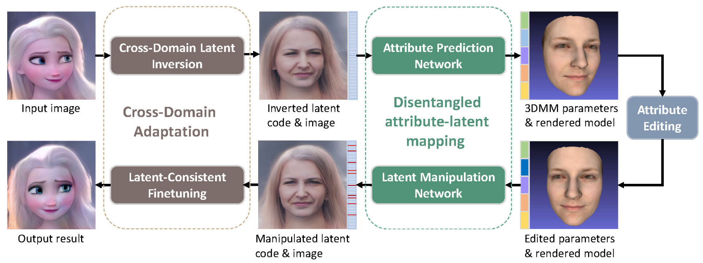

# Cross-Domain and Disentangled Face Manipulation with 3D Guidance



### [Project Page](https://cassiepython.github.io/cddfm3d/index) | [Paper (ArXiv)](https://arxiv.org/abs/2104.11228)


[Can Wang](https://cassiepython.github.io/)<sup>1</sup>,
[Menglei Chai](https://mlchai.com/)<sup>2</sup>,
[Mingming He](http://mingminghe.com/)<sup>3</sup>,
[Dongdong Chen](http://www.dongdongchen.bid/)<sup>4</sup>,
[Jing Liao](https://liaojing.github.io/html/)<sup>1</sup> <br>
<sup>1</sup>City University of Hong Kong, <sup>2</sup>Creative Vision, Snap Inc., <sup>3</sup>USC Institute for Creative Technologies, <sup>4</sup>Microsoft Cloud AI


## Abstract

Face image manipulation via three-dimensional guidance has been widely applied in various interactive scenarios due to its semantically-meaningful understanding and user-friendly controllability. However, existing 3D-morphable-model-based manipulation methods are not directly applicable to out-of-domain faces, such as non-photorealistic paintings, cartoon portraits, or even animals, mainly due to the formidable difficulties in building the model for each specific face domain. To overcome this challenge, we propose, as far as we know, the first method to manipulate faces in arbitrary domains using human 3DMM. This is achieved through two major steps: 1) disentangled mapping from 3DMM parameters to the latent space embedding of a pre-trained StyleGAN2 that guarantees disentangled and precise controls for each semantic attribute; and 2) cross-domain adaptation that bridges domain discrepancies and makes human 3DMM applicable to out-of-domain faces by enforcing a consistent latent space embedding. Experiments and comparisons demonstrate the superiority of our high-quality semantic manipulation method on a variety of face domains with all major 3D facial attributes controllable – pose, expression, shape, albedo, and illumination. Moreover, we develop an intuitive editing interface to support user-friendly control and instant feedback.


## Getting Started

### Requirements ###

- Python 3.8
- Torch 1.7.1 or Torch 1.8.0
- Pytorch3D for rendering images


### Data Preparation ###

1. Download the StyleGAN2 checkpoint from [here](https://drive.google.com/drive/folders/1LuvEw3ZZus-hFe73_G0uPmX3U8tOqPEm) and place it into the 'stylegan2-pytorch/checkpoint' directory.
2. For quickly trying our method, I recommend to generate 4W latent(StyleSpace)&image training pairs:

```
python generate_data.py --pics 40000 --ckpt checkpoint/stylegan2-ffhq-config-f.pt
```

Once finished, you will acquire 'Images', 'Latents', and 'latents.pkl' files.


### Estimate 3DMM Parameters and Facial Landmarks

1. Download checkpoint from [here](https://drive.google.com/drive/folders/1_m1ZDwc2pjMUIzl5T4_bi7ZmrBBiiSqm) and place it into the 'Deep3DFaceReconstruction-pytorch/network' directory; 
2. Download 3DMM bases from [here](https://drive.google.com/drive/folders/1_m1ZDwc2pjMUIzl5T4_bi7ZmrBBiiSqm) and place these files into the 'Deep3DFaceReconstruction-pytorch/BFM' directory;
3. Estimate 3DMM parameters and facial Landmarks:

```
cd Deep3DFaceReconstruction
python extract_gt.py ../stylegan2-pytorch/Images
```

Once finished, you will acquire the 'params.pkl' file.

## To Do
- [ ] ~~Code for generating latent&image training pairs;~~
- [ ] ~~Code for estimating 3DMM parameters and landmarks;~~
- [ ] Code and pre-trained models for the Attribute Prediction Network (After CVPR review);
- [ ] Remains ...


## References

- StyleGAN2-pytorch: https://github.com/rosinality/stylegan2-pytorch
- Deep3DFaceReconstruction-pytorch: https://github.com/changhongjian/Deep3DFaceReconstruction-pytorch

## Citation

If you find our work useful for your research, please consider citing the following papers :)

```
@article{wang2021cross,
  title={Cross-Domain and Disentangled Face Manipulation with 3D Guidance},
  author={Wang, Can and Chai, Menglei and He, Mingming and Chen, Dongdong and Liao, Jing},
  journal={arXiv preprint arXiv:2104.11228},
  year={2021}
}
```
